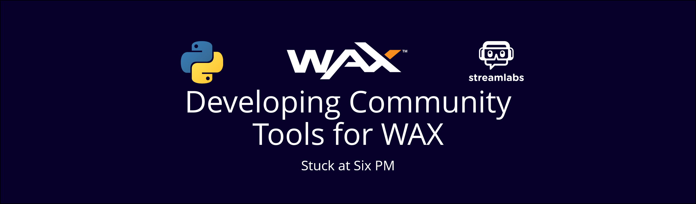

# Developing Community Tools for WAX
*Stuck at Six PM*
[View on WAX Labs](https://labs.wax.io/proposals/10)

----------



- [Developing Community Tools for WAX](#developing-community-tools-for-wax)
  - [Description](#description)
  - [Content:](#content)
  - [Financial Roadmap](#financial-roadmap)
  - [Estimated Time](#estimated-time)

## Description
Python wrapper for WAX, WAX Sweden, and Atomic Asset APIs. Goal: An open-source backbone for future projects. + Streamer WAX and NFT donation widget.

## Content:

**Categories**: 

dev.tools & marketing

**Key Outcomes:**

 - Growth of WAX community and resources available.
 - A high-quality, open-source Python Package providing a read-only wrapper for the Atomic Assets API and the WAX API that will facilitate further development in the WAX Community.
 - A community engagement platform to allow Streamers to show WAX and NFT donations they receive during their streams. This will expose WAX and NFTs to a vast audience that is largely untapped now.

**Project Overview:**

*All tools in this proposal are already under some level of development.*
Python is one of the most used programming languages. This proposal requests support for the development of an open-source high-quality API wrapper that will allow the WAX community to develop further tools. Whilst this project does not extend the WAX blockchain specifically, it provides a valuable framework for future endeavours. The project falls into 3 phases, centred around the heavily influence of NFTs on WAX's growth.

The first is the continued development of a read-only API wrapper. This API wrapper will give access to both Atomic Asset and WAX blockchain data. The resulting package will incorporate full support for Atomic Assets, including retrieval of Asset history and attributes. Various utility functions for finding and filtering assets, templates, schemas, and collections, and tools for querying transfers of assets, as sale events will also be provided. Furthermore, the package will allow checking of Wallet balance, staked resources and resource usage.

The second phase of the project, occurring in parallel, is the use of the Python wrapper in the development of a community engagement platform: a WAX and NFT donation widget for Streamlabs OBS, a popular streaming software. Streaming is a massively untapped opportunity to grow the WAX community, as last year viewers watched >25 billion hours of content. The proposed widget will announce NFT and WAX donations that arrive throughout the stream via a Streamlabs alert.
1. A streamer configures the widget and displays their wax address in their stream or via a chatbot command.
2. Viewers send NFTs or WAX to that address, with the Memo as the message they wish to show. (capped at 255 characters)
3. A donation alert, like when a streamer receives fiat donations, appears on the stream.
   
NFTs can be whitelisted by collection and the regular Streamlabs profanity/censored words filter is automatically applied over memos. Whether or not to display memos will also be configurable. This prevents any attempts to share "bad content" through the tool.

The third phase is an ongoing commitment to supporting the development of the API wrapper and Streamer Widget. As time goes on, both WAX and Atomic Assets APIs may be upgraded to accommodate future technical developments. In the same way, the API will also evolve, with updates to manage both changes to the APIs and any potential security issues. User feedback will also be vital in implementing new features, as the core goal of this project is to help the WAX community to grow.

All tools created in this project will be distributed as open-source software via GitHub.

**Potential Roadblocks:**

There are several key roadblocks that may arise. The most likely of these is sudden changes to the WAX or Atomic Assets API. If this occurs, a plan is in place to push a hot fix to the API wrapper that allows the API data to be dynamically assigned to the Classes in the Python package as a temporary workaround. Then the package will be updated to remap the new API schema to the Python Wrapper.
 
Another issue that may arise is developer incapacitation. Whilst normally this would be a very unlikely occurrence, as a single developer it falls in the realms of possibility. Such an event however would likely result in direct correspondence between myself and the WAX Labs team. 

Finally, new ways of using the WAX blockchain may arise, in which correspondence with the WAX team will resolve any issues.

## Financial Roadmap
W = WAX. All dollar amounts are USD
Exchange rate: 1W=$0.23, CMC (High+Low)/2, 17 Mar 2021

**Labor:** 

[Indeed.com US salary for "Python Developer"](https://www.indeed.com/career/python-developer/salaries) = \$109,901/y => reduce to \$100,000 to save costs: \$48.08/hr

Time invested already:  24hr

- Phase 1
   - a: Develop Atomic Assets API wrapper with utility functions for accessibility – 1.5mth - 6w. Longest part of the project, as phases 1b and 2a will likely generate revisions to phase 1a's outcome.
  - b: Robustly extend package to support WAX Sweden and Simple Assets API - 2 weeks
  - c: Ongoing support for API. Timeframe indefinite thus no funding requested.
- Phase 2
  - a: Developing Streamer NFT and Donation Widget - 4 weeks (note that further work on phase 2 will begin during phase 1b)
  - b: Onboarding of Streaming widget - 2-4 weeks. Only promotional support from WAX.io requested.

**Software Value:**

The Python package will form the backbone of future projects incorporating WAX or Atomic Assets, which is a major part of the WAX community. The Streamer NFT and Donation widget will also grow the WAX community through exposure, with 27.9b hours of streaming content being viewed in 2020. Both tools will be open-source and completely free to use, and will thus innately generate no income. However, the outcomes of this Project provide great value to the WAX community in multiple ways. Nevertheless, I personally feel that asking for funding to cover the value of software would go against the original reason I started this project: to give back to WAX. Thus, I am excluding Software Value from this proposal.

**Totals:**
```
Weeks: 12
Phase 1 and 2b working hours: 21hr/w (3hr/d, 7d/w)
Total Hours: 12\*21+24 = 276hr
Labor: 276\*48.08 = \$13,270
Graphic Design for Logos: \$250
Software Value: \$0
15% Contingency (PMI.org rec.): \$15549
WAX: 67,600W
```

**Measures to reduce costs:**
- Reduced Pay - I have set my hourly rate to $48.08, ~$10,000 below the average yearly wage.
- No "Software Value" aspect of the grant, which is usually included in calculating project worth.

## Estimated Time
84 days. Assuming 3hrs work/day.
- Phase 1a: 42 Days
- Phase 1b: 14 Days
- Phase 2a: 28 Days
